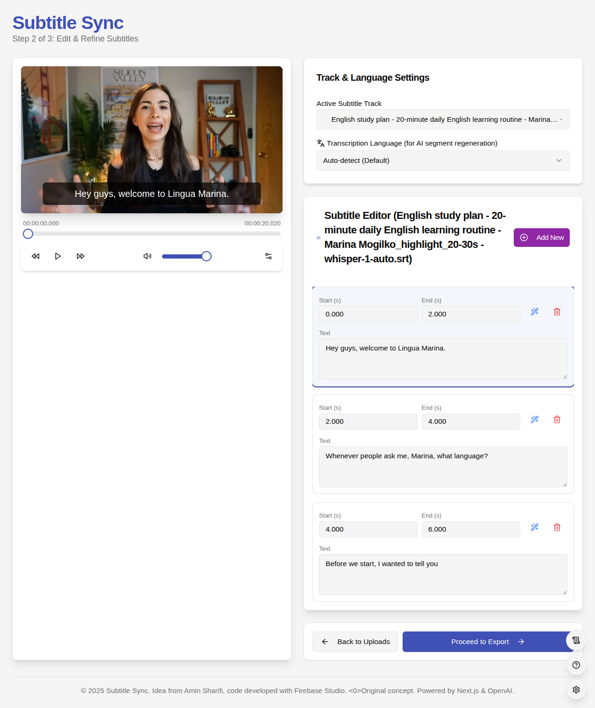
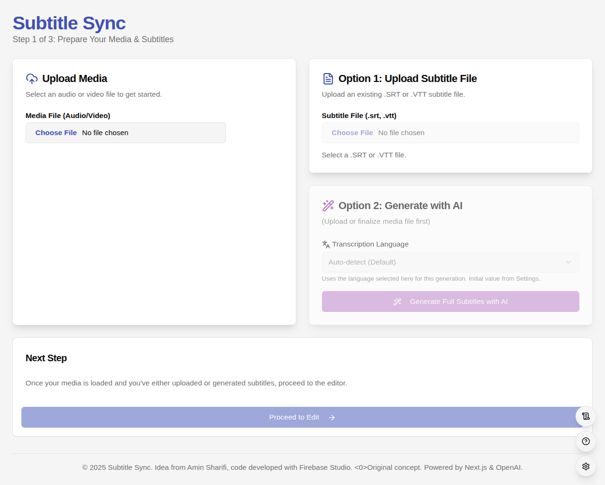
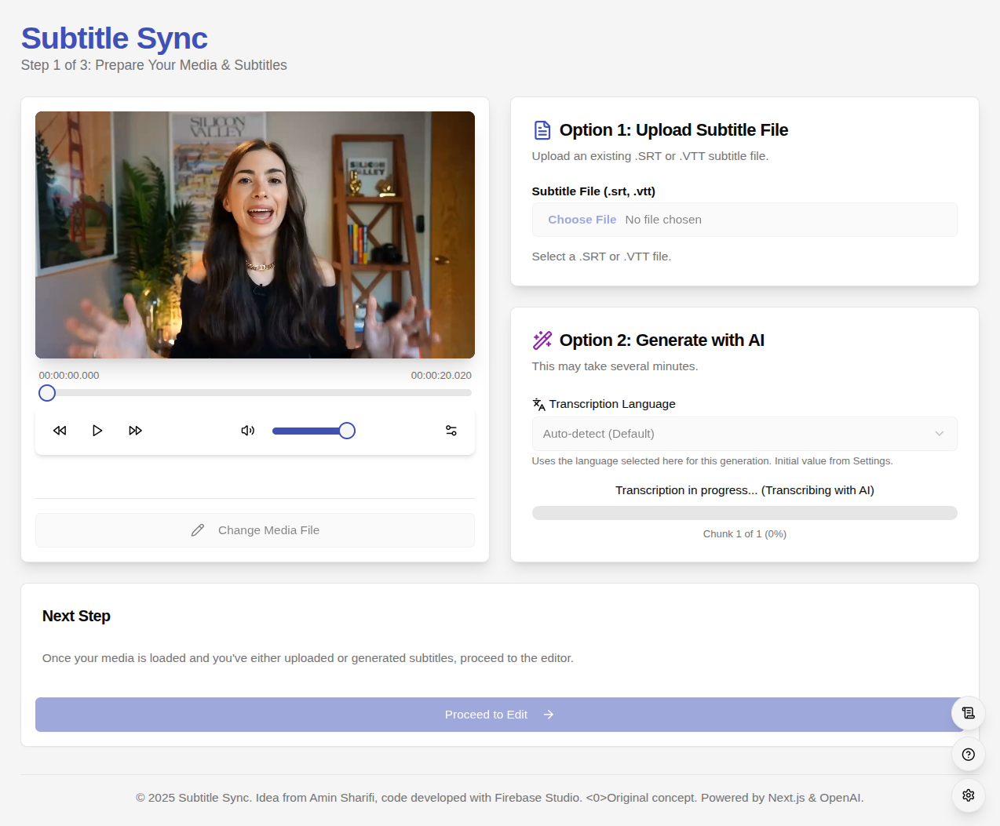
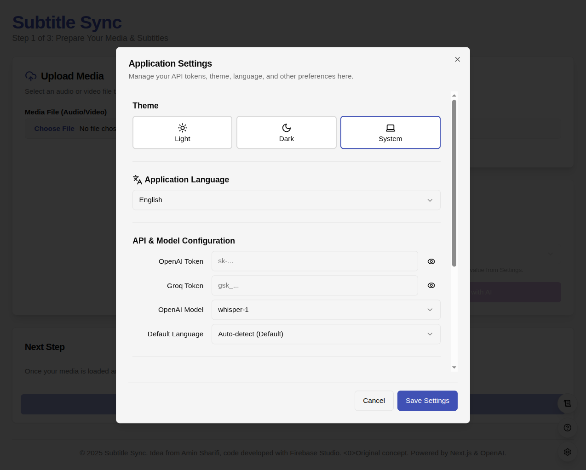
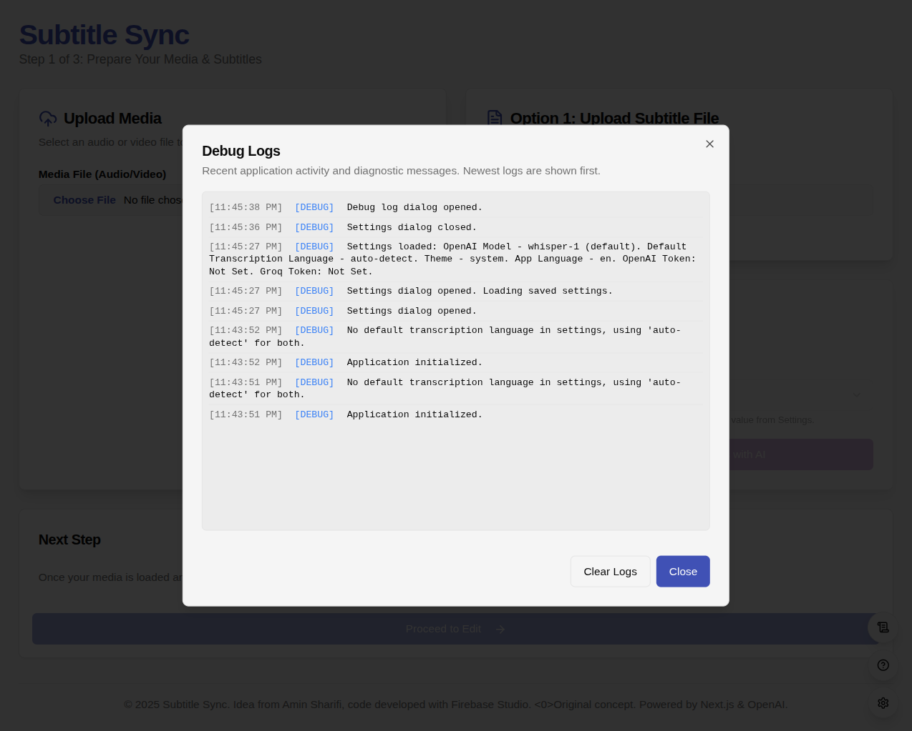

# Subtitle Flow

<div align="center">
  
  
  # 🎬 Subtitle Flow
  
  **A powerful, privacy-focused subtitle editor that runs entirely in your browser**
  
  [](LICENSE)
  [](https://github.com/moaminsharifi/subtitle-flow)
  
  [Features](#-features) • [Getting Started](#-getting-started) • [Documentation](#-documentation) • [Development](#-development)
</div>

---

## 🌟 Overview

Subtitle Flow is a professional-grade subtitle editor that operates 100% in your web browser. No backend servers, no data uploads, no privacy concerns – just powerful subtitle editing at your fingertips.

### Key Benefits

- **🔒 Complete Privacy** - All processing happens locally in your browser.
- **🔑 Bring Your Own API Key** - You control your API keys (OpenAI, Groq); they are stored locally in your browser and never sent to our servers.
- **⚡ Lightning Fast** - No network latency or server delays for core editing.
- **🌐 Works Offline** - Edit subtitles anywhere, anytime (AI features require an internet connection).
- **💰 Free Forever** - No subscriptions or hidden costs for the editor. AI features depend on your API provider's pricing.

## ✨ Features

### Core Editing
- 📁 **Multi-format Support** - Import/export SRT, VTT, and more
- ✏️ **Intuitive Timeline Editor** - Precise timing adjustments with visual cues (planned feature: waveform)
- 🎥 **Integrated Media Player** - Real-time preview and synchronization
- 🔄 **Undo/Redo** - Never lose your work with comprehensive history (planned feature)

### AI-Powered Tools
- 🤖 **Automatic Transcription** - Generate subtitles using OpenAI Whisper or Groq API models.
- 🚀 **Groq API Support** - Leverage fast and potentially free transcription tiers with your Groq API key.
- 🌍 **60+ Languages** - Support for major world languages via OpenAI.
- 🔧 **Segment Regeneration** - Fix specific parts without starting over.

### User Experience
- 🎨 **Dark/Light Themes** - Comfortable editing in any environment
- 📱 **Responsive Design** - Works on desktop, tablet, and mobile
- ⌨️ **Keyboard Shortcuts** - Speed up your workflow (view with `?` or via Settings)

## 🚀 Getting Started

### Quick Start
1. Visit [subtitle-flow.moaminsharifi.com](https://subtitile-flow.moaminsharifi.com/) (or your deployment URL)
2. Upload your video or audio file
3. Start editing or generate subtitles with AI (requires API key in Settings)
4. Export your finished subtitles

No installation, no sign-up, no hassle!

### System Requirements
- Modern web browser (Chrome, Firefox, Safari, Edge)
- 4GB RAM recommended for smooth video playback
- Internet connection required for AI transcription features

## 📖 Documentation

### User Interface

<details>
<summary>📸 Screenshots (click to expand)</summary>

#### Main Editor

*The main editing interface with timeline and preview*

#### Welcome Screen

*Clean onboarding experience*

#### AI Transcription

*Automatic subtitle generation interface*

#### Settings & Configuration

*Configure API keys and preferences*


*Helpful tips and shortcuts*


*Advanced debugging tools*

</details>

### AI Transcription Setup

To use the AI-powered transcription features, you'll need an API key from OpenAI or Groq.

#### Getting Your API Key
1.  **OpenAI**:
    *   Visit [OpenAI Platform](https://platform.openai.com/)
    *   Create an account or sign in
    *   Navigate to API Keys section
    *   Generate a new API key
    *   Copy and paste it into Subtitle Flow settings (OpenAI Token field).
2.  **Groq**:
    *   Visit [GroqCloud Console](https://console.groq.com/keys)
    *   Create an account or sign in
    *   Create a new API key
    *   Copy and paste it into Subtitle Flow settings (Groq Token field).

> **🔒 Privacy Note**: Your API keys are stored locally in your browser's localStorage and are only used to communicate directly with the respective API provider's servers. They never pass through our systems.

#### Supported Languages (via OpenAI Whisper)

<details>
<summary>🌍 View all 60+ supported languages</summary>

| Popular | European | Asian | Other |
|---------|----------|-------|--------|
| English | German | Chinese | Arabic |
| Spanish | French | Japanese | Hebrew |
| Portuguese | Italian | Korean | Turkish |
| Russian | Polish | Hindi | Persian |
| | Dutch | Vietnamese | Swahili |
| | Swedish | Thai | |
| | Norwegian | Indonesian | |
| | Danish | Malay | |
| | Finnish | Bengali | |
| | Greek | Tamil | |
| | Ukrainian | Urdu | |

*And many more! Select "Auto-detect" for automatic language detection.*

</details>

### Tips & Tricks

- **Keyboard Shortcuts**: Press `?` in the editor (or access via Settings) to view all shortcuts
- **Frame-Perfect Timing**: Use player controls and precise input in the editor for timing.
- **Batch Operations**: Select multiple subtitles with `Shift+Click` (planned feature for advanced editing)
- **Quick Export**: `Ctrl/Cmd + S` to save your work (browser-dependent, exporting is manual via Export step)

## 🛠️ Development

## Links

- [GitHub Repository](https://github.com/moaminsharifi/subtitle-flow)
- [Project Website](https://subtitile-flow.moaminsharifi.com/)


### Prerequisites
- Node.js 18+ and npm/yarn
- Git

### Local Development

```bash
# Clone the repository
git clone https://github.com/moaminsharifi/subtitle-translator-webapp.git
cd subtitle-translator-webapp # Corrected cd command based on cloned repo

# Install dependencies
npm install

# Start development server
npm run dev

# Build for production
npm run build
```

### Tech Stack
- **Frontend**: React (Next.js)
- **Styling**: Tailwind CSS, ShadCN UI
- **Media Processing**: Web Audio API, WebCodecs API (planned)
- **AI Integration**: OpenAI API, Groq API
- **Storage**: Browser localStorage (for settings), IndexedDB (planned for project persistence)

### Contributing

We welcome contributions! Please see our [Contributing Guide](CONTRIBUTING.md) for details.

1. Fork the repository
2. Create your feature branch (`git checkout -b feature/amazing-feature`)
3. Commit your changes (`git commit -m 'Add amazing feature'`)
4. Push to the branch (`git push origin feature/amazing-feature`)
5. Open a Pull Request

## 📄 License

This project is licensed under the MIT License - see the [LICENSE](LICENSE) file for details.

## 🙏 Acknowledgments

- OpenAI for the Whisper transcription model
- Groq for providing API access to fast language models
- The open-source community for inspiration and tools
- All our contributors and users

---
