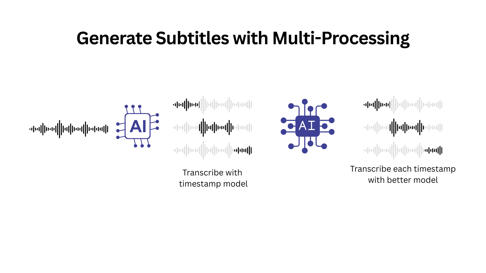

# Subtitle Flow

<div align="center">
  
  
  # 🎬 Subtitle Flow
  
  **A powerful, privacy-focused subtitle editor that runs entirely in your browser**
  
  [](LICENSE)
  [](https://github.com/moaminsharifi/subtitle-flow)
  
  [Features](#-features) • [Getting Started](#-getting-started) • [Documentation](#-documentation) • [Development](#-development)
</div>

---

## ❤️ Sponsors
<a href="https://avalai.ir" target="_blank">
  
</a>

 Proudly sponsored by [AvalAI](https://avalai.ir)

---

## 🌟 Overview

Subtitle Flow is a professional-grade subtitle editor that operates 100% in your web browser. No backend servers, no data uploads, no privacy concerns – just powerful subtitle editing at your fingertips.

### Key Benefits

- **🔒 Complete Privacy** - All processing happens locally in your browser.
- **🔑 Bring Your Own API Key** - You control your API keys (Google AI, OpenAI, Groq, AvalAI); they are stored locally in your browser and never sent to our servers.
- **⚡ Lightning Fast** - No network latency or server delays for core editing.
- **🌐 Works Offline** - Edit subtitles anywhere, anytime (AI features require an internet connection).
- **💰 Free Forever** - No subscriptions or hidden costs for the editor. AI features depend on your API provider's pricing.

## ✨ Features

### Core Editing
- 📁 **Multi-format Support** - Import/export SRT, VTT, and more
- ✏️ **Intuitive Timeline Editor** - Precise timing adjustments with visual cues (planned feature: waveform)
- 🎥 **Integrated Media Player** - Real-time preview and synchronization
- 🔄 **Undo/Redo** - Never lose your work with comprehensive history (planned feature)

### AI-Powered Tools
- 🤖 **Automatic Transcription (Full Media - Option 2)** - Generate timestamped subtitles for your entire media file using specialized models from OpenAI (Whisper), Groq (Whisper Large v3, v3-turbo), or AvalAI (Whisper-based). Configured via "Timestamp Task" settings.
- **⚡ Multi-Process Transcription (Option 3)** - A two-stage process for enhanced accuracy. First, generates full timestamped subtitles (like Option 2). Then, refines the text of each segment in parallel using models optimized for text generation (configured via "Cue/Slice Task" settings).
- 🚀 **Google AI (Gemini) for Cue/Slice Transcription** - Leverage Google's Gemini models (via your Google API key) for regenerating specific subtitle segments in the editor. Configured via "Cue/Slice Task" settings.
- ⚡ **Groq API Support** - Utilize fast Whisper models (`whisper-large-v3`, `whisper-large-v3-turbo`) for both full media transcription (Timestamp Task) and individual segment regeneration (Cue/Slice Task).
<p align="center"></p>
- 💠 **AvalAI Support** - Use AvalAI for:
    - Full media transcription with Whisper-based models (requires AvalAI API key, via "Timestamp Task" settings).
    - Segment regeneration with specific OpenAI models like `gpt-4o-transcribe`, `gpt-4o-mini-transcribe`, or `whisper-1` (requires AvalAI API key, via "Cue/Slice Task" settings).
    - Segment regeneration with Google Gemini models (requires Google API key, configured via "AvalAI (Gemini Base)" provider in "Cue/Slice Task" settings).
- 🎤 **OpenAI Models for Segment Regeneration** - Regenerate specific subtitle segments using models like `gpt-4o-transcribe`, `gpt-4o-mini-transcribe`, or `whisper-1` (requires OpenAI API key, via "Cue/Slice Task" settings).
- 🌍 **60+ Languages** - Broad language support across various AI providers for transcription.
- 🔧 **Segment Regeneration (In-Editor)** - Fix or re-transcribe specific parts of your subtitles without redoing the entire file, using models optimized for text output (configured via "Cue/Slice Task" settings).
- 🇹 **One-Click Translation (Coming Soon)** - Translate subtitles from their original language to all supported languages with a single click.
- ⚙️ **Expanded API Support (Coming Soon)** - Exploring further integrations, like OpenRouter, to expand your choices for AI-powered features.

### User Experience
- 🎨 **Dark/Light Themes** - Comfortable editing in any environment
- 📱 **Responsive Design** - Works on desktop, tablet, and mobile
- ⌨️ **Keyboard Shortcuts** - Speed up your workflow (view with `?` or via Settings)

## 🚀 Getting Started

### Quick Start
1. Visit [subtitle-flow.moaminsharifi.com](https://subtitile-flow.moaminsharifi.com/) (or your deployment URL)
2. Upload your video or audio file
3. Start editing or generate subtitles with AI (requires API key(s) in Settings)
4. Export your finished subtitles

No installation, no sign-up, no hassle!

### System Requirements
- Modern web browser (Chrome, Firefox, Safari, Edge)
- 4GB RAM recommended for smooth video playback
- Internet connection required for AI transcription features

## 📖 Documentation

### User Interface

<details>
<summary>📸 Screenshots (click to expand)</summary>

#### Main Editor

*The main editing interface with timeline and preview*

#### Welcome Screen

*Clean onboarding experience*

#### AI Transcription

*Automatic subtitle generation interface*

#### Settings & Configuration

*Configure API keys and preferences*


*Helpful tips and shortcuts*


*Advanced debugging tools*

</details>

### AI Transcription Setup

To use the AI-powered transcription features, you'll need API keys from the respective providers. Configure these in **Settings**:

1.  **Google AI (for Gemini models)**:
    *   Used for: Cue/Slice (segment) transcription, either directly ("Google AI" provider) or via "AvalAI (Gemini Base)" provider.
    *   Visit [Google AI Studio](https://aistudio.google.com/app/apikey) or Google Cloud Console.
    *   Create an account or sign in.
    *   Generate a new API key.
    *   Copy and paste it into Subtitle Flow settings (Google AI API Key field).
2.  **OpenAI**:
    *   Used for: Full media transcription (Whisper) and Cue/Slice transcription (`gpt-4o-transcribe`, `gpt-4o-mini-transcribe`, `whisper-1`).
    *   Visit [OpenAI Platform](https://platform.openai.com/)
    *   Create an account or sign in.
    *   Navigate to API Keys section.
    *   Generate a new API key.
    *   Copy and paste it into Subtitle Flow settings (OpenAI API Key field).
3.  **Groq**:
    *   Used for: Full media transcription and Cue/Slice transcription (Whisper Large v3 models like `whisper-large-v3`, `whisper-large-v3-turbo`).
    *   Visit [GroqCloud Console](https://console.groq.com/keys)
    *   Create an account or sign in.
    *   Create a new API key.
    *   Copy and paste it into Subtitle Flow settings (Groq API Key field).
4.  **AvalAI**:
    *   **For OpenAI-compatible models (Whisper for full transcription, `gpt-4o-transcribe`, etc. for cue/slice)**:
        *   Visit [AvalAI Dashboard](https://dashboard.avalai.ir/)
        *   Generate or copy your AvalAI API key.
        *   Paste into Subtitle Flow settings (AvalAI API Key field).
        *   Select "AvalAI (OpenAI Whisper/GPT)" as the provider in AI Settings for the respective task.
    *   **For Gemini-based models (for cue/slice)**:
        *   You will use your **Google AI API Key** (see step 1).
        *   In Subtitle Flow settings, select "AvalAI (Gemini Base)" as the LLM Provider for Cue/Slice Task and ensure your Google API Key is entered.

> **🔒 Privacy Note**: Your API keys are stored locally in your browser's localStorage and are only used to communicate directly with the respective API provider's servers. They never pass through our systems.

#### Supported Languages (via Whisper-based models)

<details>
<summary>🌍 View all 60+ supported languages</summary>

| Popular | European | Asian | Other |
|---------|----------|-------|--------|
| English | German | Chinese | Arabic |
| Spanish | French | Japanese | Hebrew |
| Portuguese | Italian | Korean | Turkish |
| Russian | Polish | Hindi | Persian |
| | Dutch | Vietnamese | Swahili |
| | Swedish | Thai | |
| | Norwegian | Indonesian | |
| | Danish | Malay | |
| | Finnish | Bengali | |
| | Greek | Tamil | |
| | Ukrainian | Urdu | |

*And many more! Select "Auto-detect" for automatic language detection.*

</details>

### Tips & Tricks

- **Keyboard Shortcuts**: Press `?` in the editor (or access via Settings) to view all shortcuts
- **Frame-Perfect Timing**: Use player controls and precise input in the editor for timing.
- **Batch Operations**: Select multiple subtitles with `Shift+Click` (planned feature for advanced editing)
- **Quick Export**: `Ctrl/Cmd + S` to save your work (browser-dependent, exporting is manual via Export step)

## 🛠️ Development

## Links

- [GitHub Repository](https://github.com/moaminsharifi/subtitle-flow)
- [Project Website](https://subtitile-flow.moaminsharifi.com/)


### Prerequisites
- Node.js 18+ and npm/yarn
- Git

### Local Development

```bash
# Clone the repository
git clone https://github.com/moaminsharifi/subtitle-flow.git
cd subtitle-flow

# Install dependencies
npm install

# Start development server
npm run dev

# Build for production
npm run build
```

### Tech Stack
- **Frontend**: React (Next.js)
- **Styling**: Tailwind CSS, ShadCN UI
- **AI Orchestration**: Genkit
- **AI Integration**: Google AI API, OpenAI API, Groq API, AvalAI API
- **Media Processing**: Web Audio API, WebCodecs API (planned)
- **Storage**: Browser localStorage (for settings), IndexedDB (planned for project persistence)

### Contributing

We welcome contributions! Please see our [Contributing Guide](CONTRIBUTING.md) for details.

1. Fork the repository
2. Create your feature branch (`git checkout -b feature/amazing-feature`)
3. Commit your changes (`git commit -m 'Add amazing feature'`)
4. Push to the branch (`git push origin feature/amazing-feature`)
5. Open a Pull Request

## 📄 License

This project is licensed under the MIT License - see the [LICENSE](LICENSE) file for details.

## 🙏 Acknowledgments

- Google AI for the Gemini models and Genkit
- OpenAI for the Whisper and GPT models
- Groq for providing API access to fast language models
- AvalAI for their transcription services and support
- The open-source community for inspiration and tools
- All our contributors and users

---

