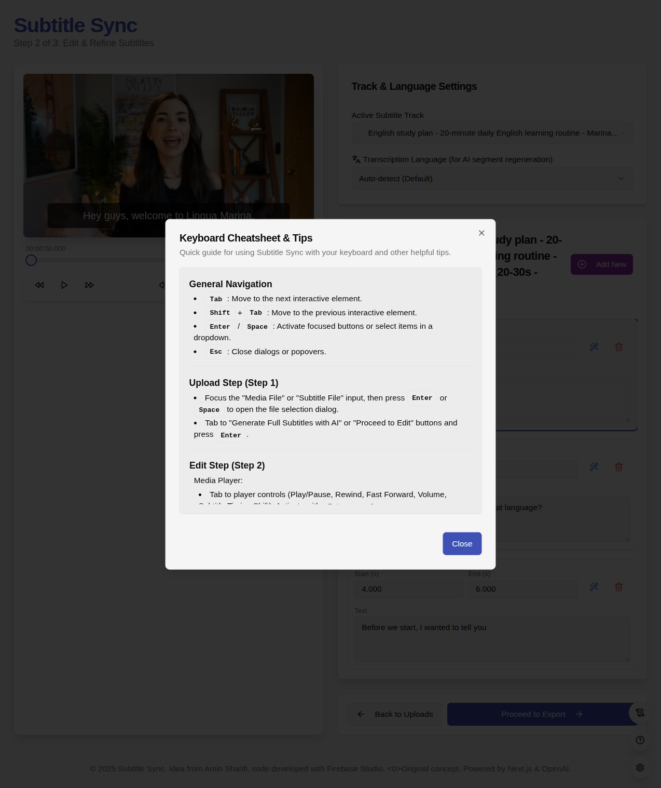

# Subtitle Flow

<div align="center">
  
  
  # 🎬 Subtitle Flow
  
  **A powerful, privacy-focused subtitle editor that runs entirely in your browser**
  
  [](LICENSE)
  [](https://github.com/moaminsharifi/subtitle-flow)
  
  [Features](#-features) • [Getting Started](#-getting-started) • [Documentation](#-documentation) • [Development](#-development)
</div>

---

## 🌟 Overview

Subtitle Flow is a professional-grade subtitle editor that operates 100% in your web browser. No backend servers, no data uploads, no privacy concerns – just powerful subtitle editing at your fingertips.

### Key Benefits

- **🔒 Complete Privacy** - All processing happens locally in your browser
- **⚡ Lightning Fast** - No network latency or server delays
- **🌐 Works Offline** - Edit subtitles anywhere, anytime
- **💰 Free Forever** - No subscriptions or hidden costs

## ✨ Features

### Core Editing
- 📁 **Multi-format Support** - Import/export SRT, VTT, and more
- ✏️ **Intuitive Timeline Editor** - Precise timing adjustments with visual waveforms
- 🎥 **Integrated Media Player** - Real-time preview and synchronization
- 🔄 **Undo/Redo** - Never lose your work with comprehensive history

### AI-Powered Tools
- 🤖 **Automatic Transcription** - Generate subtitles using OpenAI Whisper
- 🌍 **60+ Languages** - Support for major world languages
- 🔧 **Segment Regeneration** - Fix specific parts without starting over

### User Experience
- 🎨 **Dark/Light Themes** - Comfortable editing in any environment
- 📱 **Responsive Design** - Works on desktop, tablet, and mobile
- ⌨️ **Keyboard Shortcuts** - Speed up your workflow

## 🚀 Getting Started

### Quick Start
1. Visit [subtitle-flow.moaminsharifi.com](https://subtitle-flow.moaminsharifi.com) (or your deployment URL)
2. Upload your video or audio file
3. Start editing or generate subtitles with AI
4. Export your finished subtitles

No installation, no sign-up, no hassle!

### System Requirements
- Modern web browser (Chrome, Firefox, Safari, Edge)
- 4GB RAM recommended for smooth video playback
- Internet connection only required for AI transcription

## 📖 Documentation

### User Interface

<details>
<summary>📸 Screenshots (click to expand)</summary>

#### Main Editor

*The main editing interface with timeline and preview*

#### Welcome Screen

*Clean onboarding experience*

#### AI Transcription

*Automatic subtitle generation interface*

#### Settings & Configuration

*Configure API keys and preferences*


*Helpful tips and shortcuts*


*Advanced debugging tools*

</details>

### AI Transcription Setup

To use the AI-powered transcription features, you'll need an API key from OpenAI.

#### Getting Your API Key
1. Visit [OpenAI Platform](https://platform.openai.com/)
2. Create an account or sign in
3. Navigate to API Keys section
4. Generate a new API key
5. Copy and paste it into Subtitle Flow settings

> **🔒 Privacy Note**: Your API key is stored locally in your browser and is only used to communicate directly with OpenAI's servers. It never passes through our systems.

#### Supported Languages

<details>
<summary>🌍 View all 60+ supported languages</summary>

| Popular | European | Asian | Other |
|---------|----------|-------|--------|
| English | German | Chinese | Arabic |
| Spanish | French | Japanese | Hebrew |
| Portuguese | Italian | Korean | Turkish |
| Russian | Polish | Hindi | Persian |
| | Dutch | Vietnamese | Swahili |
| | Swedish | Thai | |
| | Norwegian | Indonesian | |
| | Danish | Malay | |
| | Finnish | Bengali | |
| | Greek | Tamil | |
| | Ukrainian | Urdu | |

*And many more! Select "Auto-detect" for automatic language detection.*

</details>

### Tips & Tricks

- **Keyboard Shortcuts**: Press `?` in the editor to view all shortcuts
- **Frame-Perfect Timing**: Use `←` `→` keys to nudge timings by frames
- **Batch Operations**: Select multiple subtitles with `Shift+Click`
- **Quick Export**: `Ctrl/Cmd + S` to save your work

## 🛠️ Development

## Links

- [GitHub Repository](https://github.com/moaminsharifi/subtitle-flow)
- [Project Website](https://subtitile-flow.moaminsharifi.com/)


### Prerequisites
- Node.js 18+ and npm/yarn
- Git

### Local Development

```bash
# Clone the repository
git clone https://github.com/moaminsharifi/subtitle-translator-webapp.git
cd subtitle-translator-webapp # Corrected cd command based on cloned repo

# Install dependencies
npm install

# Start development server
npm run dev

# Build for production
npm run build
```

### Tech Stack
- **Frontend**: React/Vue/Svelte (specify your framework)
- **Styling**: Tailwind CSS / Material-UI
- **Media Processing**: WebCodecs API
- **AI Integration**: OpenAI API
- **Storage**: IndexedDB for local persistence

### Contributing

We welcome contributions! Please see our [Contributing Guide](CONTRIBUTING.md) for details.

1. Fork the repository
2. Create your feature branch (`git checkout -b feature/amazing-feature`)
3. Commit your changes (`git commit -m 'Add amazing feature'`)
4. Push to the branch (`git push origin feature/amazing-feature`)
5. Open a Pull Request

## 📄 License

This project is licensed under the MIT License - see the [LICENSE](LICENSE) file for details.

## 🙏 Acknowledgments

- OpenAI for the Whisper transcription model
- The open-source community for inspiration and tools
- All our contributors and users

---

